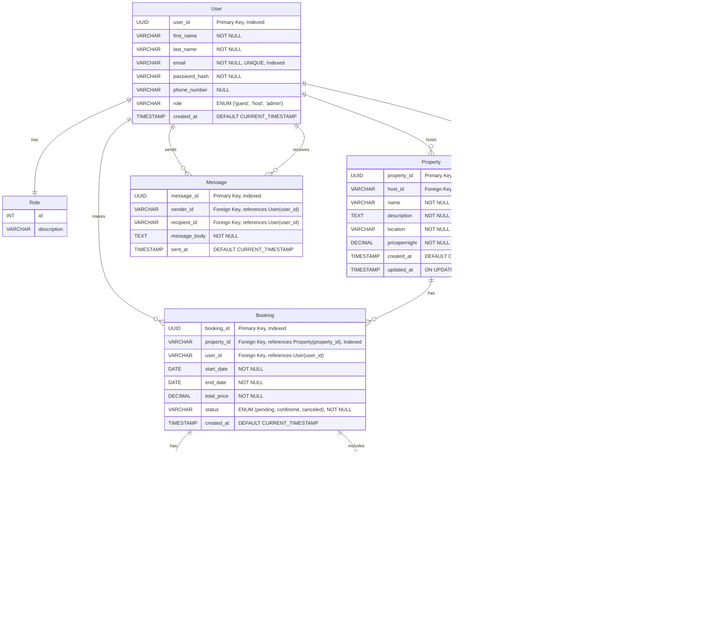

# Database ER Diagram

```mermaid
erDiagram
    User {
        UUID user_id "Primary Key, Indexed"
        VARCHAR first_name "NOT NULL"
        VARCHAR last_name "NOT NULL"
        VARCHAR email "NOT NULL, UNIQUE, Indexed"
        VARCHAR password_hash "NOT NULL"
        VARCHAR phone_number "NULL"
        VARCHAR role "ENUM ('guest', 'host', 'admin')"
        TIMESTAMP created_at "DEFAULT CURRENT_TIMESTAMP"
    }

    Role {
        INT id
        VARCHAR description
    }

    Property {
        UUID property_id "Primary Key, Indexed"
        VARCHAR host_id "Foreign Key, references user_id"
        VARCHAR name "NOT NULL"
        TEXT description "NOT NULL"
        VARCHAR location "NOT NULL"
        DECIMAL pricepernight "NOT NULL"
        TIMESTAMP created_at "DEFAULT CURRENT_TIMESTAMP"
        TIMESTAMP updated_at "ON UPDATE CURRENT_TIMESTAMP"
    }

    Booking {
        UUID booking_id "Primary Key, Indexed"
        VARCHAR property_id "Foreign Key, references Property(property_id), Indexed"
        VARCHAR user_id "Foreign Key, references User(user_id)"
        DATE start_date "NOT NULL"
        DATE end_date "NOT NULL"
        DECIMAL total_price "NOT NULL"
        VARCHAR status "ENUM (pending, confiremd, canceled), NOT NULL"
        TIMESTAMP created_at "DEFAULT CURRENT_TIMESTAMP"
    }

    Status {
        INT status_id
        VARCHAR description
    }

    Payment {
        UUID payment_id "Primary Key, Indexed"
        VARCHAR booking_id "Foreign Key, references Booking(booking_id), Indexed"
        DECIMAL amount "NOT NULL"
        TIMESTAMP payment_date "DEFAULT CURRENT_TIMESTAMP"
        VARCHAR payment_method "ENUM (credit_card, paypal, stripe), NOT NULL"
    }

    PaymentMethod {
        INT payment_method_id
        VARCHAR description
    }

    Review {
        UUID review_id "Primary Key, Indexed"
        VARCHAR property_id "Foreign Key, references Property(property_id)"
        VARCHAR user_id "Foreign Key, references User(user_id)"
        INTEGER rating "Check rating >=1 AND rating <= 5, NOT NULL"
        TEXT comment "NOT NULL"
        TIMESTAMP created_at "DEFAULT CURRENT_TIMESTAMP"
    }

    Message {
        UUID message_id "Primary Key, Indexed"
        VARCHAR sender_id "Foreign Key, references User(user_id)"
        VARCHAR recipient_id "Foreign Key, references User(user_id)"
        TEXT message_body "NOT NULL"
        TIMESTAMP sent_at "DEFAULT CURRENT_TIMESTAMP"
    }

    User ||--o{ Property : hosts
    User ||--o{ Booking : makes
    User ||--o{ Review : writes
    User ||--o{ Message : sends
    User ||--o{ Message : receives
    Property ||--o{ Booking : has
    Property ||--o{ Review : receives
    Booking ||--o{ Payment : includes
    Booking ||--|| Status : has
    Payment ||--|| PaymentMethod : uses
    User ||--|| Role : has


```
